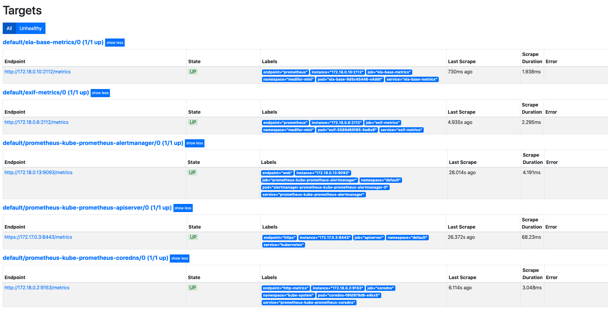

# Prometheus Monitoring Setup
This document will guide you through the steps to:
- Set up Prometheus on your cluster
- Set up Grafana on your cluster
- Create metrics endpoints for the analytic containers

These instructions assumes you are using Minikube for your cluster.

## Prerequisites
- Kubernetes Cluster 1.10+
- Helm 3.0.0+

<br />

## Install Prometheus and Grafana
### Add prometheus-community Helm chart
```bash
$ helm repo add prometheus-community https://prometheus-community.github.io/helm-charts
$ helm repo update
```
### Install Chart
Install the `kube-prometheus-stack` chart with a release name of `prometheus` in the default kubernetes namespace. <br/>
```bash
$ helm install prometheus prometheus-community/kube-prometheus-stack
```
For more information, visit the [kube-prometheus-stack](https://github.com/prometheus-community/helm-charts/tree/main/charts/kube-prometheus-stack) repository.

### Update Your Medifor Release
Now that Prometheus is running on the cluster you can update your `medifor` helm release to create the analytic services and servic monitors which expose the metrics endpoints to Prometheus.
```bash
$ helm upgrade --set prometheus.enabled=true medifor <medifor-helm-chart path>
```
See the *[helm upgrade](https://helm.sh/docs/helm/helm_upgrade/)* docs for more information.

### Verify Metrics Services 
You'll want to check that the services for the analytic metrics were created.
```bash
$ kubectl --namespace=<medifor-namespace> get services

NAME               TYPE        CLUSTER-IP       EXTERNAL-IP   PORT(S)          AGE
analyticworkflow   ClusterIP   10.104.207.102   <none>        50051/TCP        11m
ela-base-metrics   ClusterIP   10.100.51.161    <none>        2112/TCP         2m53s
eqmedifor          ClusterIP   10.108.223.183   <none>        37706/TCP        11m
exif-metrics       ClusterIP   10.108.106.22    <none>        2112/TCP         2m53s
medifor-demo-ui    NodePort    10.107.178.35    <none>        3000:30000/TCP   11m
pgmedifor          ClusterIP   None             <none>        5432/TCP         11m
```
All analytics in the system should have a service with a name `analyticname-metrics`. These services are what communicate with the prometheus service monitors.

```bash
$ kubectl get servicemonitoras

NAME                                                 AGE
ela-base-metrics                                     4m38s
exif-metrics                                         4m38s
prometheus-kube-prometheus-alertmanager              6m21s
prometheus-kube-prometheus-apiserver                 6m21s
prometheus-kube-prometheus-coredns                   6m21s
prometheus-kube-prometheus-grafana                   6m21s
prometheus-kube-prometheus-kube-controller-manager   6m21s
prometheus-kube-prometheus-kube-etcd                 6m21s
prometheus-kube-prometheus-kube-proxy                6m21s
prometheus-kube-prometheus-kube-scheduler            6m21s
prometheus-kube-prometheus-kube-state-metrics        6m21s
prometheus-kube-prometheus-kubelet                   6m21s
prometheus-kube-prometheus-node-exporter             6m21s
prometheus-kube-prometheus-operator                  6m21s
prometheus-kube-prometheus-prometheus                6m21s
```

<br />

## Expose Services
Since this example is using Minikube you can port forward Prometheus and Grafana out of the minikube cluster to your localhost. <br/>
If using an alternate cluster setup you will need to modify how you expose these services. <br />
See *[http://kubernetes.io/docs/user-guide/services/](http://kubernetes.io/docs/user-guide/services/)* for more information.

### Prometheus
Expose Prometheus service
```bash
$ kubectl port-forward service/prometheus-kube-prometheus-prometheus 9090:9090
```
##### In the `Targets` view you should be able to see metrics endpoints for every running analytic along with the default cluster metrics.
<br />



##### These metrics endpoint will also provide you with three additional queries found below.
<br />


### Grafana
Expose Grafana service
```bash
$ kubectl port-forward servive/promtheus-grafana 80:80
```
You will be prompted for a username and password which are defaulted to:
- Username: admin
- Password: prom-operator

Grafana ships with a variety of dashboards and monitoring tools. Please visit their *[user guide](https://grafana.com/docs/grafana/latest/dashboards/)* for more information.